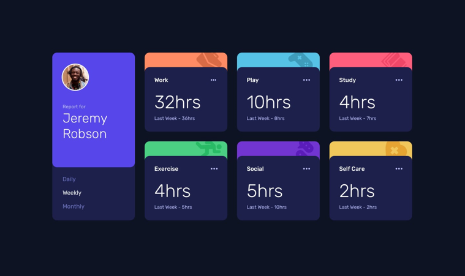
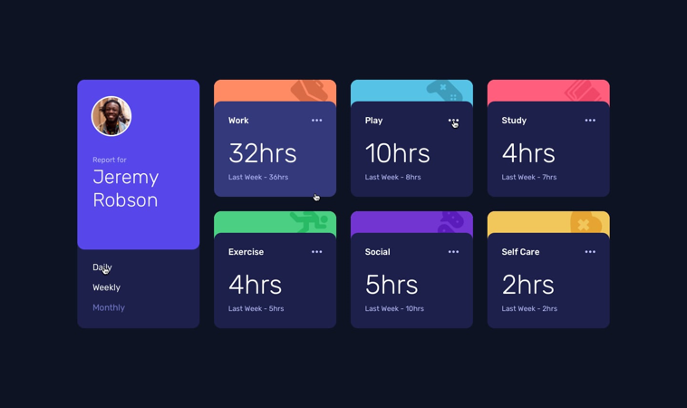
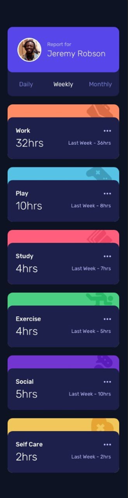

# Time Tracking Dashboard

Esta é uma solução para o desafio [Time Tracking Dashboard](https://www.frontendmentor.io/challenges/time-tracking-dashboard-UIQ7167Jw) do Frontend Mentor.

## Índice

- [Sobre o projeto](#sobre-o-projeto)
  - [O desafio](#o-desafio)
  - [Design](#design)
    - [Desktop](#desktop)
    - [Mobile](#mobile)
  - [Tecnologias](#tecnologias)
- [Autor](#autor)

## Sobre o projeto

### O desafio

Os usuários devem ser capazes de:

- Ver o layout ideal do site, dependendo do tamanho da tela de seus dispositivos
- Ver os estados de hover para todos os elementos interativos na página
- Alternar entre visualizar estatísticas Diárias, Semanais e Mensais

### Design

Abaixo há imagens do design proposto por Frontend Mentor para o desafio.

#### Desktop

Tela inicial:

Estados ativos:

#### Mobile

### Tecnologias

#### Desenvolvido com:

- HTML
- CSS
- Flexbox
- CSS Grid
- JavaScript
- Webpack
- Babel

### Links

- Acessar solução desenvolvida: [jvs-time-tracking-dashboard.netlify.app](https://jvs-time-tracking-dashboard.netlify.app/)

## Autor

- Linkedin - [Jhony Vill da Silva](https://www.linkedin.com/in/jhony-vill-da-silva-390239210)
